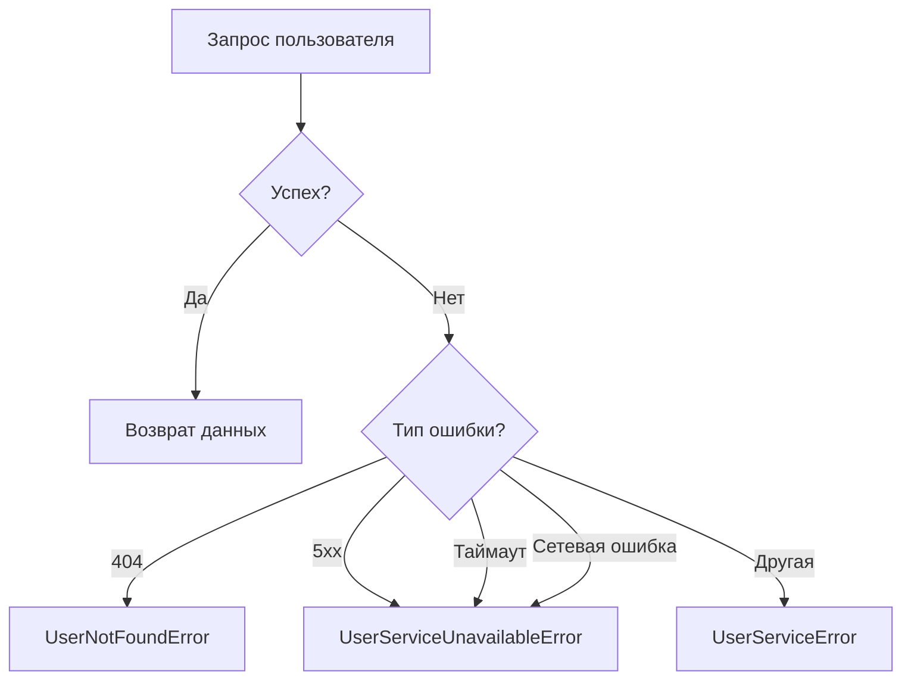

# Сервис пользователей

Модуль `users_service` предоставляет интерфейс для работы с данными пользователей через внешний микросервис.

## Обзор

Сервис обеспечивает:

- Получение данных пользователей по ID
- Обработку сетевых ошибок
- Автоматические повторы запросов
- Кэширование результатов

## Интерфейсы

### ABCUserService

Абстрактный базовый класс, определяющий контракт для работы с пользователями.

::: src.service_layer.users_service.ABCUserService
    :docstring:
    :members: get_by_id

## Реализация

### UserService

Реализация сервиса для работы с внешним API пользователей.

::: src.service_layer.users_service.UserService
    :docstring:
    :members: __init__

## Особенности реализации

### Политика повторных попыток

Сервис автоматически повторяет запросы при возникновении временных ошибок:

- Экспоненциальная задержка между попытками
- Максимум 3 попытки
- Повтор при таймаутах и 5xx ошибках

### Обработка ошибок



## Примеры использования

### Получение данных пользователя

```python
from uuid import UUID
from src.service_layer.users_service import UserService

# Инициализация сервиса
user_service = UserService(
    base_url="https://users-api.example.com",
    max_retries=3
)

# Получение пользователя
async def get_user_profile(user_id: UUID):
    try:
        user = await user_service.get_by_id(user_id)
        return {
            'id': user['id'],
            'name': user['name'],
            'email': user['email']
        }
    except UserNotFoundError:
        return None
    except UserServiceUnavailableError as e:
        logger.error(f"Сервис пользователей недоступен: {e}")
        raise
```

## Рекомендации по использованию

1. **Инициализация**
   - Создавайте один экземпляр на всё приложение
   - Используйте DI для внедрения зависимостей

2. **Обработка ошибок**
   ```python
   try:
       user = await user_service.get_by_id(user_id)
   except UserNotFoundError:
       # Обработка отсутствия пользователя
       pass
   except UserServiceUnavailableError:
       # Обработка временной недоступности
       pass
   ```

3. **Кэширование**
   ```python
   from functools import lru_cache
   
   class CachedUserService(UserService):
       @lru_cache(maxsize=1000)
       async def get_by_id(self, user_id: UUID) -> dict:
           return await super().get_by_id(user_id)
   ```

## Производительность

- Таймаут запроса: 5 секунд
- Максимальное количество попыток: 3
- Экспоненциальная задержка между попытками
- Keep-alive соединения

## Мониторинг

Рекомендуемые метрики:

- Количество запросов
- Время ответа
- Количество ошибок по типам
- Размер кэша (если используется)

## Связанные компоненты

- [Обработка ошибок](./exceptions.md)
- [Unit of Work](./uow.md)
- [Настройки приложения](../config/loader.md)
